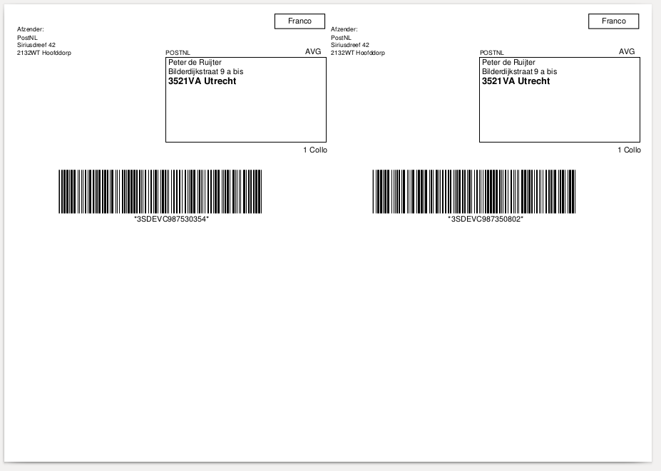

.. _quickstart:

==========
Quickstart
==========

This page provides a quick introduction to this library and a few quick copy/paste examples which you can adjust to your likings.
If you do not have the library installed, head over to the :ref:`installation`
page.

.. _doing a request:

----------------
Doing a Request
----------------

You can do requests over the API by creating the request objects and passing them to one of the functions in the main :php:class`Firstred\\PostNL\\PostNL`
class.

Creating request objects may seem a bit counter-intuitive at first, but this makes it a lot easier to follow the request examples from the `official API documentation <https://developer.postnl.nl/>`_ and quickly figure out what each field does.

Using an IDE with code completion is **strongly recommended**.

--------------------------------------------------------------
Requesting timeframes, locations and the delivery date at once
--------------------------------------------------------------

You can request the timeframes, locations and delivery date at once to quickly retrieve all the available delivery options.

.. note::

    For more details on how to retrieve delivery options, consult the :ref:`delivery options` chapter.

Here's how it is done from scratch:

.. code-block:: php

    <?php

    use Firstred\PostNL\Entity\Label;
    use Firstred\PostNL\PostNL;
    use Firstred\PostNL\Entity\Customer;
    use Firstred\PostNL\Entity\Address;
    use Firstred\PostNL\Entity\Shipment;
    use Firstred\PostNL\Entity\Dimension;

    require_once __DIR__.'/vendor/autoload.php';

    // Your PostNL credentials
    $customer = Customer::create([
        'CollectionLocation' => '123456',
        'CustomerCode'       => 'DEVC',
        'CustomerNumber'     => '11223344',
        'ContactPerson'      => 'Sander',
        'Address'            => Address::create([
            'AddressType' => '02',
            'City'        => 'Hoofddorp',
            'CompanyName' => 'PostNL',
            'Countrycode' => 'NL',
            'HouseNr'     => '42',
            'Street'      => 'Siriusdreef',
            'Zipcode'     => '2132WT',
        ]),
        'Email'              => 'test@voorbeeld.nl',
        'Name'               => 'Michael',
    ]);

    $apikey = 'YOUR_API_KEY_HERE';
    $sandbox = true;

    $postnl = new PostNL($customer, $apikey, $sandbox, PostNL::MODE_REST);

    $mondayDelivery = true;
    $deliveryDaysWindow = 7; // Amount of days to show ahead
    $dropoffDelay = 0;       // Amount of days to delay delivery

    // Configure the cut-off window for every day, 1 = Monday, 7 = Sunday
    $cutoffTime = '15:00:00';
    $dropoffDays = [1 => true, 2 => true, 3 => true, 4 => true, 5 => true, 6 => false, 7 => false];
    foreach (range(1, 7) as $day) {
        if ($dropoffDays[$day]) {
            $cutOffTimes[] = new CutOffTime(
                str_pad($day, 2, '0', STR_PAD_LEFT),
                date('H:i:00', strtotime($cutoffTime)),
                true
            );
        }
    }

    $response = $postnl->getTimeframesAndNearestLocations(
        (new GetTimeframes())
            ->setTimeframe([
                (new Timeframe())
                    ->setCountryCode('NL')
                    ->setEndDate(date('d-m-Y', strtotime(" +{$deliveryDaysWindow} days +{$dropoffDelay} days")))
                    ->setHouseNr('66')
                    ->setOptions(['Morning', 'Daytime'])
                    ->setPostalCode('2132WT')
                    ->setStartDate(date('d-m-Y', strtotime(" +1 day +{$request['dropoff_delay']} days")))
                    ->setSundaySorting(!empty($mondayDelivery) && date('w', strtotime("+{$dropoffDelay} days")))
            ]),
        (new GetNearestLocations())
            ->setCountrycode($request['cc'])
            ->setLocation(
                (new Location())
                    ->setAllowSundaySorting(!empty($mondayDelivery))
                    ->setDeliveryOptions(['PG'])
                    ->setOptions(['Daytime'])
                    ->setHouseNr('66')
                    ->setPostalcode('2132WT')
            ),
        (new GetDeliveryDate())
            ->setGetDeliveryDate(
                (new GetDeliveryDate())
                    ->setAllowSundaySorting(!empty($mondayDelivery))
                    ->setCountryCode('NL')
                    ->setCutOffTimes($cutOffTimes)
                    ->setHouseNr($request['number'])
                    ->setOptions($deliveryOptions)
                    ->setPostalCode('2132WT')
                    ->setShippingDate(date('d-m-Y H:i:s'))
                    ->setShippingDuration(strval(1 + (int) $dropoffDelay))
            )
            ->setMessage(new Message())
    );

The response variable will be an associative array containing the timeframes, nearest locations and delivery date. It has the following keys:

.. confval:: timeframes

    This is a :php:class:`Firstred\\PostNL\\Entity\\Response\\ResponseTimeframes` object containing all the timeframes. You can iterate over all the available timeframes as follows.

    .. code-block:: php

        foreach ($response['timeframes'] as $timeframe) {
            $date = $timeframe->getDate()->format('Y-m-d');

            // Note that a timeframe object might have multiple embedded timeframes.
            // This might happen when you request both `Daytime` and `Evening` timeframes
            $from = $timeframe->getTimeframes()[0]->getFrom();
            $to = $timeframe->getTimeframes()[0]->getTo();

            echo "$date - from: $from, to: $to\n";
        }

        // Output: 2020-03-03 - from: 12:15:00, to: 14:00:00

    .. note::

        Note that the API usually groups timeframes by date, but is not guaranteed to do so, so do not rely on it!

 The embedded timeframes contain the actual timeframes on that particular day.

        The response format is the same for both the SOAP and REST API and is described on this page:
        https://developer.postnl.nl/browse-apis/delivery-options/timeframe-webservice/testtool-rest/#/Timeframe/get_calculate_timeframes

    .. note::

        Dates and times returned by the library always use the same format for consistency and therefore may differ from the API.
        Please refer to the :ref:`formats` chapter for more information.

.. confval:: locations

    The pickup locations can be found in the :php:class:`Firstred\\PostNL\\Entity\\Response\\GetNearestLocationsResponse` object.

.. confval:: delivery_date

    The delivery date that was found in a :php:class:`Firstred\\PostNL\\Entity\\Response\\GetDeliveryDateResponse` object.

-------------------------
Requesting a merged label
-------------------------

Here is how you can request two labels and have them merged into a single PDF automatically:

.. code-block:: php

    use Firstred\PostNL\Entity\Label;
    use Firstred\PostNL\PostNL;
    use Firstred\PostNL\Entity\Customer;
    use Firstred\PostNL\Entity\Address;
    use Firstred\PostNL\Entity\Shipment;
    use Firstred\PostNL\Entity\Dimension;

    require_once __DIR__.'/vendor/autoload.php';

    // Your PostNL credentials
    $customer = Customer::create([
        'CollectionLocation' => '123456',
        'CustomerCode'       => 'DEVC',
        'CustomerNumber'     => '11223344',
        'ContactPerson'      => 'Sander',
        'Address'            => Address::create([
            'AddressType' => '02',
            'City'        => 'Hoofddorp',
            'CompanyName' => 'PostNL',
            'Countrycode' => 'NL',
            'HouseNr'     => '42',
            'Street'      => 'Siriusdreef',
            'Zipcode'     => '2132WT',
        ]),
        'Email'              => 'test@voorbeeld.nl',
        'Name'               => 'Michael',
    ]);

    $apikey = 'YOUR_API_KEY_HERE';
    $sandbox = true;

    $postnl = new PostNL($customer, $apikey, $sandbox, PostNL::MODE_SOAP);

    $barcodes = $postnl->generateBarcodesByCountryCodes(['NL' => 2]);

    $shipments = [
        Shipment::create([
            'Addresses'           => [
                Address::create([
                    'AddressType' => '01',
                    'City'        => 'Utrecht',
                    'Countrycode' => 'NL',
                    'FirstName'   => 'Peter',
                    'HouseNr'     => '9',
                    'HouseNrExt'  => 'a bis',
                    'Name'        => 'de Ruijter',
                    'Street'      => 'Bilderdijkstraat',
                    'Zipcode'     => '3521VA',
                ]),
            ],
            'Barcode'             => $barcodes['NL'][0],
            'Dimension'           => new Dimension('1000'),
            'ProductCodeDelivery' => '3085',
        ]),
        Shipment::create([
            'Addresses'           => [
                Address::create([
                    'AddressType' => '01',
                    'City'        => 'Utrecht',
                    'Countrycode' => 'NL',
                    'FirstName'   => 'Peter',
                    'HouseNr'     => '9',
                    'HouseNrExt'  => 'a bis',
                    'Name'        => 'de Ruijter',
                    'Street'      => 'Bilderdijkstraat',
                    'Zipcode'     => '3521VA',
                ]),
            ],
            'Barcode'             => $barcodes['NL'][1],
            'Dimension'           => new Dimension('1000'),
            'ProductCodeDelivery' => '3085',
        ]),
    ];

    $label = $postnl->generateLabels(
        $shipments,
        'GraphicFile|PDF', // Printertype (only PDFs can be merged -- no need to use the Merged types)
        true, // Confirm immediately
        true, // Merge
        Label::FORMAT_A4, // Format -- this merges multiple A6 labels onto an A4
        [
            1 => true,
            2 => true,
            3 => true,
            4 => true,
        ] // Positions
    );

    file_put_contents('labels.pdf', $label);

This will write a ``labels.pdf`` file that looks like this:



The PostNL client constructor accepts a few options:

customer
    ``Customer`` - `required`

    The ``Customer`` object that is used to configure the client and let PostNL know
    who is requesting the data.

    .. code-block:: php

        // Create a new customer
        $client = new Customer::create([
          'CollectionLocation' => '123456',                    // Your collection location
          'CustomerCode'       => 'DEVC',                      // Your Customer Code
          'CustomerNumber'     => '11223344',                  // Your Customer Number
          'GlobalPackBarcodeType('CX'),                        // Add your GlobalPack information if you need
          'GlobalPackCustomerCode('1234'),                     // to create international shipment labels
          'ContactPerson'      => 'Sander',
          'Address'            => Address::create([
              'AddressType' => '02',                           // This address will be shown on the labels
              'City'        => 'Hoofddorp',
              'CompanyName' => 'PostNL',
              'Countrycode' => 'NL',
              'HouseNr'     => '42',
              'Street'      => 'Siriusdreef',
              'Zipcode'     => '2132WT',
          ]),
          'Email'              => 'test@voorbeeld.nl',
          'Name'               => 'Michael',
      ]);

apikey
    ``string``|``UsernameToken`` - `required`

    The ``apikey`` to use for the API. Note that if you want to switch from the legacy API to
    the new SOAP and REST API you will have to request a new key. The username can be omitted.
    If you want to connect to the legacy API you should pass a ``UsernameToken`` with your username and token set:

    .. code-block:: php

        $usernameToken = new UsernameToken('username', 'token');

    You can request an API key for the sandbox environment on this page: https://developer.postnl.nl/content/request-api-key
    For a live key you should contact your PostNL account manager.

sandbox
    ``bool`` - `required`

    Indicate whether you'd like to connect to the sandbox environment. When `false` the library uses the live endpoints.

mode
    ``int`` - `optional, defaults to REST`

    This library provides three ways to connect to the API:

    - 1: REST mode
    - 2: SOAP mode
    - 5: Legacy mode -- This is the previous SOAP API, which at the moment of writing is still in operation.

-----------------
Building Requests
-----------------

In most cases you would want to create request objects and pass them to one of the methods of the main object (``PostNL``).
One exception is the Barcode Service. You can directly request multiple barcodes and for multiple countries at once. The library
will internally handle the concurrent requests to the API.

In the above-mentioned merged label example we are passing two ``Shipment`` objects, filled with the needed information to generate the labels.
To merge those labels manually, we have to set the merge option to ``false`` and can omit both the ``format`` and ``positions`` parameters.
This will in turn make the library return ``GenerateLabelResponse`` objects.

These are in line with the ``GenerateLabelResponse`` nodes generated by the SOAP API, even when using the REST API.
The main reason for this standardization is that the SOAP API has better documentation. If you need a quick reference of
the ``GenerateLabelResponse`` object, you can either look up the code of the ``GenerateLabelResponse`` class or
`navigate to the API documentation directly <https://developer.postnl.nl/apis/labelling-webservice/documentation#toc-9>`_.

Sending concurrent requests
===========================

There is no direct need to manually handle concurrent requests. This library handles most cases automatically
and even provides a special function to quickly grab timeframe and location data for frontend delivery options widgets.

In case you manually want to send a custom mix of requests, you can look up the corresponding functions in the
Service class of your choice and call the ```buildXXXXXXRequest()``` functions manually. Thanks to the PSR-7 standard
used by this library you can use the ``Request`` object that is returned to access the full request that would otherwise
be sent directly. To pick up where you left off you can then grab the response and pass it to one of the ``processXXXXXXXResponse()```
functions of the Service class. The easiest method is to grab the raw HTTP message and parse it with the included PSR-7 library.
An example can be found in the `cURL client <https://github.com/firstred/postnl-api-php/blob/b3837cec23e1b8e806c5ea29d79d0fae82a0e956/src/HttpClient/CurlClient.php#L258>`_.

Using Response objects
======================

.. note::

    This section refers to Response objects returned by the library, not the standardized PSR-7 messages.

As soon as you've done your first request with this library, you will find that it returns a Response object.
As mentioned in the `Building Requests` section, these Response objects are based on the SOAP API, regardless of the mode set.
The properties of a Response object can be looked up in the code, but it can be a bit confusing at times, since the
Response object will likely not contain all properties at once. It often depends on the context of the request. For this reason,
you're better off by having a look at the `SOAP API documentation <https://developer.postnl.nl>`_ directly or by checking out some of
the examples in this documentation.

