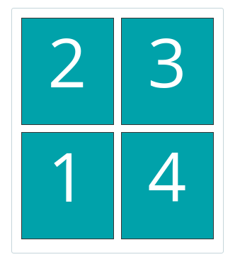

.. _sendandtrackshipments:
.. _send and track shipments:

========================
Send and track shipments
========================

Sending shipments can be done in one of two ways:

#. Using the Shipping webservice
#. Using the Barcode, Labelling and Confirming webservice

This library supports both methods. In this sections we'll go through all the available webservices.

.. _barcode webservice:

Barcode webservice
------------------

.. note::

    | PostNL API documentation for this service:
    | https://developer.postnl.nl/apis/barcode-webservice/overview

The barcode service allows you to generate barcodes for your shipment labels.
Usually you would reserve an amount of barcodes, generate shipping labels and eventually confirm those labels.
According to PostNL, this flow is necessary for a higher delivery success rate.

Generate a single barcode
~~~~~~~~~~~~~~~~~~~~~~~~~

You can generate a single barcode for domestic shipments as follows:

.. code-block:: php

    $postnl->generateBarcode();

This will generate a 3S barcode meant for domestic shipments only.

The method :php:meth:`Firstred\\PostNL\\PostNL::generateBarcode` accepts the following arguments:

.. confval:: type
    :required: False
    :default: ``3S``

    The barcode type. This is 2S/3S for the Netherlands and EU Pack Special shipments.
    For other destinations this is your GlobalPack barcode type.
    For more info, check the `PostNL barcode service page <https://developer.postnl.nl/apis/barcode-webservice/how-use#toc-7>`_.

.. confval:: range
    :required: False
    :default: ``null``

     For domestic and EU shipments this is your customer code. Otherwise, your GlobalPack customer code.

.. confval:: serie
    :required: False
    :default: ``null``

    This is the barcode range for your shipment(s).
    Check the `PostNL barcode service page <https://developer.postnl.nl/apis/barcode-webservice/how-use#toc-7>`_
    for the ranges that are available.

.. confval:: eps
    :required: False
    :default: ``false``

    Indicates whether this is an EU Pack Special shipment.

Generate a barcode by country code
~~~~~~~~~~~~~~~~~~~~~~~~~~~~~~~~~~

It is possible to generate a barcode by country code. This will let the library figure out what
type, range, serie to use.

Example:

.. code-block:: php

    $postnl->generateBarcodeByCountryCode('BE');

This will generate a 3S barcode meant for domestic shipments only.

The method :php:meth:`Firstred\\PostNL\\PostNL::generateBarcodeByCountryCode` accepts the following arguments:

.. confval:: iso
    :required: True

    The two letter country ISO-3166 alpha-2 code. Make sure you use UPPERCASE.
    List of ISO-3166 codes: https://www.iban.com/country-codes

Generate multiple barcodes by using country codes
~~~~~~~~~~~~~~~~~~~~~~~~~~~~~~~~~~~~~~~~~~~~~~~~~

You can generate a whole batch of barcodes at once by providing country codes and the
amounts you would like to generate.

Example:

.. code-block:: php

    $postnl->generatesBarcodeByCountryCodes(['NL' => 2, 'DE' => 3]);

The method :php:meth:`Firstred\\PostNL\\PostNL::generateBarcodesByCountryCodes` will return a list of barcodes:

.. code-block:: php

    [
        'NL' => [
            '3SDEVC11111111111',
            '3SDEVC22222222222',
        ],
        'DE' => [
            '3SDEVC111111111',
            '3SDEVC222222222',
            '3SDEVC333333333',
        ],
    ];

The function accepts the following argument:

.. confval:: type
    :required: true

    This must be an associative array with country codes as key and the amount of barcodes you'd like to generate
    per country as the value.

.. _labelling webservice:

Labelling webservice
--------------------

.. note::

    | PostNL API documentation for this service:
    | https://developer.postnl.nl/apis/labelling-webservice

The labelling service allows you to create shipment labels and optionally confirm the shipments.
The library has a built-in way to merge labels automatically, so you can request labels for multiple shipments at once.

.. _generate a single label:

Generate a single label
~~~~~~~~~~~~~~~~~~~~~~~

The following example generates a single shipment label for a domestic shipment:

.. code-block:: php

    $postnl = new PostNL(...);
    $postnl->generateLabel(
        Shipment::create()
            ->setAddresses([
                Address::create([
                    'AddressType' => '01',
                    'City'        => 'Utrecht',
                    'Countrycode' => 'NL',
                    'FirstName'   => 'Peter',
                    'HouseNr'     => '9',
                    'HouseNrExt'  => 'a bis',
                    'Name'        => 'de Ruijter',
                    'Street'      => 'Bilderdijkstraat',
                    'Zipcode'     => '3521VA',
                ]),
                Address::create([
                    'AddressType' => '02',
                    'City'        => 'Hoofddorp',
                    'CompanyName' => 'PostNL',
                    'Countrycode' => 'NL',
                    'HouseNr'     => '42',
                    'Street'      => 'Siriusdreef',
                    'Zipcode'     => '2132WT',
                ]),
            ])
            ->setBarcode($barcode)
            ->setDeliveryAddress('01')
            ->setDimension(new Dimension('2000'))
            ->setProductCodeDelivery('3085'),
        'GraphicFile|PDF',
        false
    );

This will create a standard shipment (product code 3085). You can access the label (base64 encoded PDF) this way:

.. code-block:: php

    $pdf = base64_decode($label->getResponseShipments()[0]->getLabels()[0]->getContent());

This function accepts the following arguments:

.. confval:: shipment
    :required: true

    The :php:class:`Firstred\\PostNL\\Entity\\Shipment` object. Visit the PostNL API documentation to find out what a :php:class:`Firstred\\PostNL\\Entity\\Shipment` object consists of. The :php:class:`Firstred\\PostNL\\Entity\\Shipment` object is based on the SOAP API: https://developer.postnl.nl/browse-apis/send-and-track/labelling-webservice/documentation-soap/

.. confval:: printerType
    :required: true
    :default: ``GraphicFile|PDF``

    The list of supported printer types can be found on this page: https://developer.postnl.nl/browse-apis/send-and-track/labelling-webservice/documentation-soap/

.. confval:: confirm
    :required: false
    :default: ``true``

    Indicates whether the shipment should immediately be confirmed.

Generate multiple shipment labels
~~~~~~~~~~~~~~~~~~~~~~~~~~~~~~~~~

The following example shows how a label can be merged:

.. code-block:: php

    $shipments = [
        Shipment::create([
            'Addresses'           => [
                Address::create([
                    'AddressType' => '01',
                    'City'        => 'Utrecht',
                    'Countrycode' => 'NL',
                    'FirstName'   => 'Peter',
                    'HouseNr'     => '9',
                    'HouseNrExt'  => 'a bis',
                    'Name'        => 'de Ruijter',
                    'Street'      => 'Bilderdijkstraat',
                    'Zipcode'     => '3521VA',
                ]),
            ],
            'Barcode'             => $barcodes['NL'][0],
            'Dimension'           => new Dimension('1000'),
            'ProductCodeDelivery' => '3085',
        ]),
        Shipment::create([
            'Addresses'           => [
                Address::create([
                    'AddressType' => '01',
                    'City'        => 'Utrecht',
                    'Countrycode' => 'NL',
                    'FirstName'   => 'Peter',
                    'HouseNr'     => '9',
                    'HouseNrExt'  => 'a bis',
                    'Name'        => 'de Ruijter',
                    'Street'      => 'Bilderdijkstraat',
                    'Zipcode'     => '3521VA',
                ]),
            ],
            'Barcode'             => $barcodes['NL'][1],
            'Dimension'           => new Dimension('1000'),
            'ProductCodeDelivery' => '3085',
        ]),
    ];

    $label = $postnl->generateLabels(
        $shipments,
        'GraphicFile|PDF', // Printertype (only PDFs can be merged -- no need to use the Merged types)
        true, // Confirm immediately
        true, // Merge
        Label::FORMAT_A4, // Format -- this merges multiple A6 labels onto an A4
        [
            1 => true,
            2 => true,
            3 => true,
            4 => true,
        ] // Positions
    );

    file_put_contents('labels.pdf', $label);

By setting the `merge` flag it will automatically merge the labels into a PDF string.

The function accepts the following arguments:

.. confval:: shipments
    :required: true

    An array with :php:class:`Firstred\\PostNL\\Entity\\Shipment` objects.
    Visit the PostNL API documentation to find out what a :php:class:`Firstred\\PostNL\\Entity\\Shipment` object consists of. The :php:class:`Firstred\\PostNL\\Entity\\Shipment` object is based on the SOAP API: https://developer.postnl.nl/browse-apis/send-and-track/labelling-webservice/documentation-soap/

.. confval:: printerType
    :required: false
    :default: ``GraphicFile|PDF``

    The list of supported printer types can be found on this page: https://developer.postnl.nl/browse-apis/send-and-track/labelling-webservice/documentation-soap/

.. confval:: confirm
    :required: false
    :default: ``true``

    Indicates whether the shipment should immediately be confirmed.

.. confval:: merge
    :required: false
    :default: ``false``

    This will merge the labels and make the function return a pdf string of the merged label.

.. confval:: format
    :required: false
    :default: :php:const:`Firstred\\PostNL\\PostNL::FORMAT_A4`

    This sets the paper format (can be `Firstred\\PostNL\\PostNL::FORMAT_A4` or `Firstred\\PostNL\\PostNL::FORMAT_A6`).

.. confval:: positions
    :required: false
    :default: ``[1 => true, 2 => true, 3 => true, 4 => true]``

    This will set the positions of the labels. The following image shows the available positions, use `true` or `false` to resp. enable or disable a position:

.. _shipping webservice:

Shipping webservice
-------------------

.. note::

    | PostNL API documentation for this service:
    | https://developer.postnl.nl/browse-apis/send-and-track/shipping-webservice/

The shipping service combines all the functionality of the labeling, confirming, barcode and easy return service.
The service is only available as REST.

.. _send a single shipment:

Send a single shipment
~~~~~~~~~~~~~~~~~~~~~~

The following example sends a single domestic shipment:

.. code-block:: php

    $postnl = new PostNL(...);
    $postnl->sendShipment(
        Shipment::create()
            ->setAddresses([
                Address::create([
                    'AddressType' => '01',
                    'City'        => 'Utrecht',
                    'Countrycode' => 'NL',
                    'FirstName'   => 'Peter',
                    'HouseNr'     => '9',
                    'HouseNrExt'  => 'a bis',
                    'Name'        => 'de Ruijter',
                    'Street'      => 'Bilderdijkstraat',
                    'Zipcode'     => '3521VA',
                ]),
                Address::create([
                    'AddressType' => '02',
                    'City'        => 'Hoofddorp',
                    'CompanyName' => 'PostNL',
                    'Countrycode' => 'NL',
                    'HouseNr'     => '42',
                    'Street'      => 'Siriusdreef',
                    'Zipcode'     => '2132WT',
                ]),
            ])
            ->setDeliveryAddress('01')
            ->setDimension(new Dimension('2000'))
            ->setProductCodeDelivery('3085'),
        'GraphicFile|PDF',
        false
    );

This will create a standard shipment (product code 3085). You can access the label (base64 encoded PDF) this way:

.. code-block:: php

    $pdf = base64_decode($shipping->getResponseShipments()[0]->getLabels()[0]->getContent());

This function accepts the following arguments:

.. confval:: shipment
    :required: true

    The :php:class:`Firstred\\PostNL\\Entity\\Shipment` object. Visit the PostNL API documentation to find out what a Shipment object consists of.

.. confval:: printertype
    :required: false
    :default: ``GraphicFile|PDF``

    The list of supported printer types can be found on this page: https://developer.postnl.nl/browse-apis/send-and-track/shipping-webservice/documentation/

.. confval:: confirm
    :required: false
    :default: ``true``

    Indicates whether the shipment should immediately be confirmed.

.. _send multiple shipments:

Send multiple shipments
~~~~~~~~~~~~~~~~~~~~~~~

The following example shows how labels of multiple shipment labels can be merged:

.. code-block:: php

    $shipments = [
        Shipment::create([
            'Addresses'           => [
                Address::create([
                    'AddressType' => '01',
                    'City'        => 'Utrecht',
                    'Countrycode' => 'NL',
                    'FirstName'   => 'Peter',
                    'HouseNr'     => '9',
                    'HouseNrExt'  => 'a bis',
                    'Name'        => 'de Ruijter',
                    'Street'      => 'Bilderdijkstraat',
                    'Zipcode'     => '3521VA',
                ]),
            ],
            'Dimension'           => new Dimension('1000'),
            'ProductCodeDelivery' => '3085',
        ]),
        Shipment::create([
            'Addresses'           => [
                Address::create([
                    'AddressType' => '01',
                    'City'        => 'Utrecht',
                    'Countrycode' => 'NL',
                    'FirstName'   => 'Peter',
                    'HouseNr'     => '9',
                    'HouseNrExt'  => 'a bis',
                    'Name'        => 'de Ruijter',
                    'Street'      => 'Bilderdijkstraat',
                    'Zipcode'     => '3521VA',
                ]),
            ],
            'Dimension'           => new Dimension('1000'),
            'ProductCodeDelivery' => '3085',
        ]),
    ];

    $label = $postnl->generateShippings(
        $shipments,
        'GraphicFile|PDF', // Printertype (only PDFs can be merged -- no need to use the Merged types)
        true, // Confirm immediately
        true, // Merge
        Label::FORMAT_A4, // Format -- this merges multiple A6 labels onto an A4
        [
            1 => true,
            2 => true,
            3 => true,
            4 => true,
        ] // Positions
    );

    file_put_contents('labels.pdf', $label);

By setting the `merge` flag it will automatically merge the labels into a PDF string.

The function accepts the following arguments:

.. confval:: shipments
    :required: true

    An array with :php:class:`Firstred\\Entity\\Shipment` objects. Visit the PostNL API documentation to find out what a Shipment object consists of.

.. confval:: printertype
    :required: false
    :default: ``GraphicFile|PDF``

    The list of supported printer types can be found on this page: https://developer.postnl.nl/browse-apis/send-and-track/shipping-webservice/documentation/

.. confval:: confirm
    :required: false
    :default: ``true``

    Indicates whether the shipment should immediately be confirmed.

.. confval:: merge
    :required: false
    :default: ``false``

    This will merge the labels and make the function return a pdf string of the merged label.

.. confval:: format
    :required: false
    :default: :php:const:`Firstred\\PostNL\\PostNL::FORMAT_A4`

    This sets the paper format (can be :php:const:`Firstred\\PostNL\\PostNL::FORMAT_A4` or :php:const:`Firstred\\PostNL\\PostNL::FORMAT_A6`).

.. confval:: positions
    :required: false
    :default: ``[1 => true, 2 => true, 3 => true, 4 => true]``

    This will set the positions of the labels. The following image shows the available positions, use ``true`` or ``false`` to resp. enable or disable a position:

.. _confirming webservice:

Confirming webservice
---------------------

.. note::

    | PostNL API documentation for this service:
    | https://developer.postnl.nl/apis/confirming-webservice

You can confirm shipments that have previously not been confirmed. Shipments can be confirmed after both the :ref:`labelling webservice` or the :ref:`shipping webservice`.

The available methods are :php:meth:`Firstred\\PostNL\\PostNL::confirmShipment` and :php:meth:`Firstred\\PostNL\\PostNL::confirmShipments`. The first method accepts a single :php:class:`Firstred\\PostNL\\Entity\\Shipment` object whereas the latter accepts an array of :php:class:`Firstred\\PostNL\\Entity\\Shipment`s.

Example code:

.. code-block:: php

    $postnl = new PostNL(...);

    $confirmedShipment = $postnl->confirmShipment(
        (new Shipment())
            ->setAddresses([
                Address::create([
                    'AddressType' => '01',
                    'City'        => 'Utrecht',
                    'Countrycode' => 'NL',
                    'FirstName'   => 'Peter',
                    'HouseNr'     => '9',
                    'HouseNrExt'  => 'a bis',
                    'Name'        => 'de Ruijter',
                    'Street'      => 'Bilderdijkstraat',
                    'Zipcode'     => '3521VA',
                ]),
                Address::create([
                    'AddressType' => '02',
                    'City'        => 'Hoofddorp',
                    'CompanyName' => 'PostNL',
                    'Countrycode' => 'NL',
                    'HouseNr'     => '42',
                    'Street'      => 'Siriusdreef',
                    'Zipcode'     => '2132WT',
                ]),
            ])
            ->setBarcode('3SDEVC201611210')
            ->setDeliveryAddress('01')
            ->setDimension(new Dimension('2000'))
            ->setProductCodeDelivery('3085')
    );

The output is a :php:class:`Firstred\\PostNL\\Entity\\Respone\\ConfirmingResponseShipment` or an array with these objects in case you are confirming multiple shipments. The results array will have the same index keys as the request input.

.. _shippingstatus webservice:

Shippingstatus webservice
--------------------------

.. note::

    | PostNL API documentation for this service:
    | https://developer.postnl.nl/apis/shippingstatus-webservice

This service can be used to retrieve shipping statuses. For a short update request a `current status`, otherwise `complete status` will provide you with a long list containing the shipment's history.

.. _current or complete shipping status by barcode:

Current or complete shipping status by barcode
~~~~~~~~~~~~~~~~~~~~~~~~~~~~~~~~~~~~~~~~~~~~~~

Gets the current or complete status by barcode. A complete status also includes the shipment history.

.. code-block:: php

     $postnl = new PostNL(...);
     $postnl->getShippingStatusByBarcode('3SDEVC98237423');

.. confval:: barcode
    :required: true

    The barcode, e.g.: ``3SDEVC98237423``

.. confval:: complete
    :required: false

    Return the complete shipping status. This includes the shipment history.

Depending on the ``complete`` parameter this returns a :php:class:`Firstred\\PostNL\\Entity\\Response\\CurrentStatusResponseShipment` or a :php:class:`Firstred\\PostNL\\Entity\\Response\\CompleteStatusResponseShipment` object.

.. _multiple current complete statuses by barcodes:

Multiple current or complete shipping statuses by barcodes
~~~~~~~~~~~~~~~~~~~~~~~~~~~~~~~~~~~~~~~~~~~~~~~~~~~~~~~~~~~~

Gets multiple current or complete statuses by barcodes. A complete status also includes the shipment history.

.. code-block:: php

     $postnl = new PostNL(...);
     $postnl->getShippingStatusesByBarcodes(['3SDEVC98237423', '3SDEVC98237423']);

.. confval:: barcodes
    :required: true

    The references, e.g.: ``['3SDEVC98237423', '3SDEVC98237423']``

.. confval:: complete
    :required: false

    Return the complete shipping status. This includes the shipment history.

Depending on the ``complete`` parameter this returns an array with :php:class:`Firstred\\PostNL\\Entity\\Response\\CurrentStatusResponseShipment` or :php:class:`Firstred\\PostNL\\Entity\\Response\\CompleteStatusResponseShipment` objects.
The array is an associative array indexed by the given barcodes, e.g.: ``['3SDEVC98237423' => CurrentStatusResponseShipment, ...]``.

.. _current or complete shipping status by reference:

Current or complete shipping status by reference
~~~~~~~~~~~~~~~~~~~~~~~~~~~~~~~~~~~~~~~~~~~~~~~~

Gets the current or complete status by reference. A complete status also includes the shipment history.

.. code-block:: php

     $postnl = new PostNL(...);
     $postnl->getShippingStatusByReference('order-12');

.. confval:: reference
    :required: true

    The barcode, e.g.: ``order-12``

.. confval:: complete
    :required: false

    Return the complete shipping status. This includes the shipment history.

Depending on the ``complete`` parameter this returns a :php:class:`Firstred\\PostNL\\Entity\\Response\\CurrentStatusResponseShipment` or a :php:class:`Firstred\\PostNL\\Entity\\Response\\CompleteStatusResponseShipment` object.

.. _multiple current complete statuses by references:

Multiple current or complete shipping statuses by references
~~~~~~~~~~~~~~~~~~~~~~~~~~~~~~~~~~~~~~~~~~~~~~~~~~~~~~~~~~~~

Gets multiple current or complete statuses by references. A complete status also includes the shipment history.

.. code-block:: php

     $postnl = new PostNL(...);
     $postnl->getShippingStatusesByReferences(['order-12', 'order-16']);

.. confval:: barcodes
    :required: true

    The references, e.g.: ``['order-12', 'order-16]``

.. confval:: complete
    :required: false

    Return the complete shipping status. This includes the shipment history.

Depending on the ``complete`` parameter this returns an array with :php:class:`Firstred\\PostNL\\Entity\\Response\\CurrentStatusResponseShipment` or :php:class:`Firstred\\PostNL\\Entity\\Response\\CompleteStatusResponseShipment` objects.
The array is an associative array indexed by the given references, e.g.: ``['order-12' => CurrentStatusResponseShipment, ...]``.

.. _current status by status code:

Current status by status code
~~~~~~~~~~~~~~~~~~~~~~~~~~~~~

.. warning::

    This is no longer supported by the PostNL API.

.. _current status by phase code:

Current status by phase code
~~~~~~~~~~~~~~~~~~~~~~~~~~~~

Gets the current status by phase code. Note that the date range is required.

.. warning::

    This is no longer supported by the PostNL API

.. _complete status by status code:

Complete status by status code
~~~~~~~~~~~~~~~~~~~~~~~~~~~~~~

.. warning::
    This is no longer supported by the PostNL API.

.. _complete status by phase code:

Complete status by phase code
~~~~~~~~~~~~~~~~~~~~~~~~~~~~~

.. warning::
    This is no longer supported by the PostNL API.

.. _get a single signature:

Get a single signature by barcode
~~~~~~~~~~~~~~~~~~~~~~~~~~~~~~~~~

Gets the signature of the shipment when available. A signature can be accessed by barcode only.

.. code-block:: php

    $postnl = new PostNL(...);
    $postnl->getSignatureByBarcode('3SDEVC23987423');

It accepts the following arguments

.. confval:: barcode
    :required: true

    The shipment's barcode, e.g. ``3SDEVC23987423``

This method returns a :php:class:`Firstred\\PostNL\\Entity\\Response\\GetSignatureResponseSignature` object. To get the actual signature in binary format you will have to use:

.. code-block:: php

    $postnl = new PostNL(...);

    $getSignatureResponseSignature = $postnl->getSignatureByBarcode('3SDEVC23987423');
    $content = base64_decode($getSignatureResponseSignature->getSignatureImage());

    header('Content-Type: image/gif');
    echo $content;
    exit;

.. _get multiple signatures:

Get multiple signatures by barcodes
~~~~~~~~~~~~~~~~~~~~~~~~~~~~~~~~~~~

Gets multiple signatures of multiple shipments, when available.

.. code-block:: php

    $postnl = new PostNL(...);
    $postnl->getSignaturesByBarcodes(['3SDEVC23987423', '3SDEVC23987425']);

It accepts the following arguments

.. confval:: barcodes
    :required: true

    An array of barcodes, e.g. ``['3SDEVC23987423', '3SDEVC23987425']``.

It returns an array of :php:class:`Firstred\\PostNL\\Entity\\Response\\GetSignatureResponseSignature` objects.
To get the image data out of these objects, see :ref:`get a single signature`.
